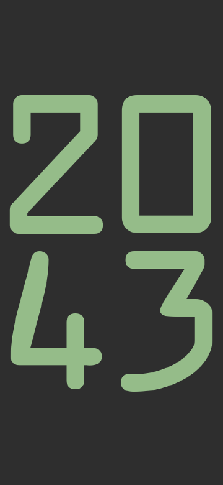

### bigclock

I wanted to take a stab at making something with Godot for Android. Was looking for the shortest distance to get there. I think a couple labels and four lines of code counts as shortest distance.

I like having the time somewhere on my desk when I'm working. My phone is always on my desk. Phone need big clock.

